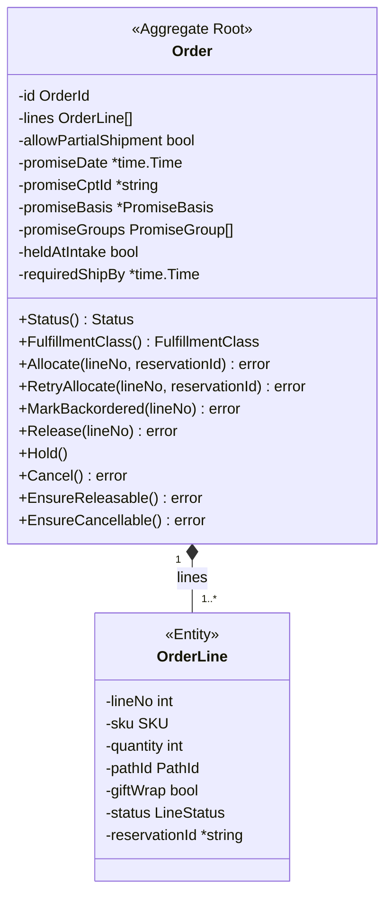
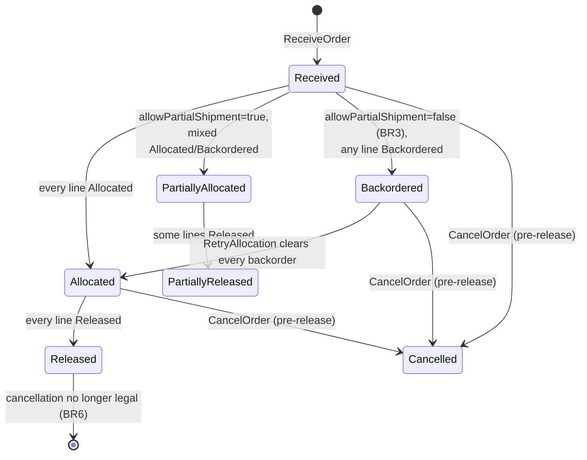

# Aggregates & Invariants

One aggregate root, one entity, one value-object package. Every invariant
below is enforced **in the domain layer**, per `CLAUDE.md`'s "Aggregates &
invariants" section, and has a dedicated failing-path unit test.

## Order

**The aggregate root.** Owns `OrderId`, `OrderLine[]`,
`AllowPartialShipment bool`, `Status`, the promise (`PromiseDate`,
`PromiseCptId`, `PromiseBasis` = `Capability` / `LeadTime` / `Network`, and
per-shipment-group `PromiseGroups` —
[ADR 0014](/docs/adr/0014-promise-derived-from-fulfillment-capability),
[0017](/docs/adr/0017-per-shipment-group-promising)), and — since
[ADR 0020](/docs/adr/0020-network-originated-demand-hold-and-deadline-feasibility)
— the hold flag (`ReleaseOnAllocation()`, stored inversely as
`heldAtIntake`) and optional `RequiredShipBy`. A hold is deliberately not a
new `Status`: a held order is simply allocated and not yet released.

### Invariants

| Invariant | Enforcement |
| --- | --- |
| **Cannot allocate the same line twice.** | `Allocate` rejects a line not in `Pending` or `Backordered`. |
| **Cannot release a line that isn't `Allocated`.** | `Release` rejects any other line status. |
| **Cannot cancel once ANY line is `Released`.** | `EnsureCancellable` returns `ErrOrderAlreadyReleased`. |
| **Order-level `Status` is always computed from line statuses, never stored redundantly.** | `Status()` derives the value on every call; there is no backing field. |
| **A held order must be ship-complete.** | `ErrHeldOrderMustBeShipComplete` at intake when `releaseOnAllocation=false` and `allowPartialShipment=true` (ADR 0020). |

### Status derivation

## OrderLine

**A single requested item within an `Order`.**

| Field | Meaning |
| --- | --- |
| `SKU` | The stock keeping unit ordered. |
| `Quantity` | Must be > 0. |
| `PathId` | Process path this line's work is enqueued onto; resolved internally by `PathSelectionPolicy` (today always `"pick"`), never supplied by the caller (ADR 0005/0013/0016). |
| `GiftWrap` | Whether the requester asked for gift packaging. |
| `LineStatus` | `Pending` / `Allocated` / `Backordered` / `Released` / `Cancelled`. |
| `ReservationId` | Set once allocated; needed to cancel. |

### Invariants

| Invariant | Enforcement |
| --- | --- |
| **`Quantity` must be > 0.** | Rejected at construction (`ReceiveOrder`). |
| **`SKU` must be non-empty.** | Rejected at construction. |
| **A `Backordered` line may transition back to `Allocated` ONLY via `RetryAllocation`.** | No other use case touches a `Backordered` line's status. |

## BR3 — ship-complete default

`AllowPartialShipment=false` (the default): if ANY line ends up
`Backordered` during allocation, the WHOLE order's status is
`Backordered` (no line proceeds to release) until a human/caller issues
`RetryAllocation`. `AllowPartialShipment=true`: allocated lines are
independently eligible for release; order status becomes
`PartiallyAllocated`. See
[ADR 0003](/docs/adr/0003-ship-complete-default-and-fail-closed-allocation).

## BR6 — cancellation boundary

`CancelOrder` is legal ONLY while no line has reached `Released`. Legal
cancellation revokes every allocated line's reservation via
`DELETE /reservations/{id}` on inventory-storage. Once ANY line is
`Released`, v1 does NOT claw back released work — this is a documented,
deliberate known gap (same honesty pattern as inventory-storage's
ADR-0003 "no expiry sweeper" section), not an oversight to silently paper
over. See
[ADR 0004](/docs/adr/0004-cancellation-boundary-at-release).

## Value objects (`internal/domain/shared`)

| Type | Rule |
| --- | --- |
| `OrderId` | Identity, minted by `OrderRepo.NextID` |
| `SKU` | Non-empty string |
| `PathId` | Non-empty string; defaults to `pick` when a line omits it |

Every failing-path test named in `CLAUDE.md`'s "Aggregates & invariants"
section — bin-capacity-style rejections, double-allocation, releasing an
unallocated line, cancelling after release, backordering via any route
other than `RetryAllocation` — has a dedicated unit test in
`internal/domain/order` and `internal/application/usecases`.
