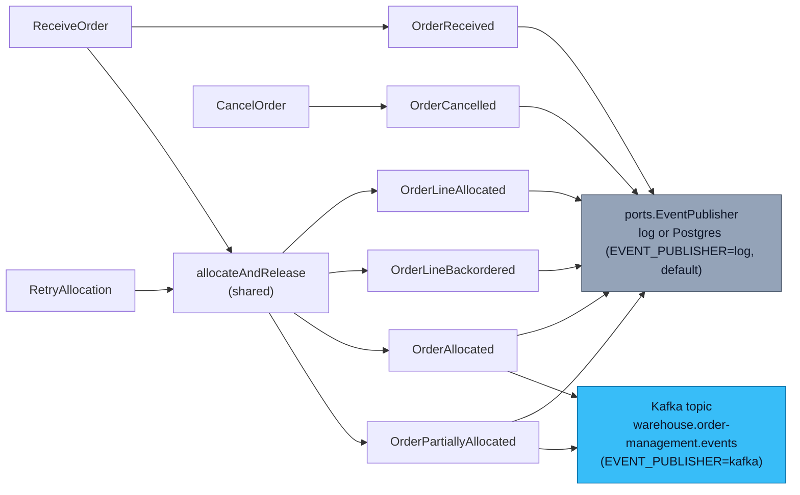

# Domain Events

Nine past-tense events, raised by the `Order` aggregate (plus
`RepromiseOrder`, a use case that reacts to an inbound event rather than
an order lifecycle transition). Every event is
published through `ports.EventPublisher`, which — since
[ADR 0005](/docs/adr/0005-choreographed-release-via-kafka) — has TWO real
implementations selected by the `EVENT_PUBLISHER` env var:

- **`log`** (default): every event is logged as JSON, in-process only.
- **`kafka`**: the SAME events are logged/persisted locally as before, but
  `OrderAllocated`, `OrderPartiallyAllocated`, and — since
  [ADR 0018](/docs/adr/0018-repromise-order-consumer-and-order-repromised)
  — `OrderRepromised` are ADDITIONALLY
  forwarded to the shared Kafka broker, topic
  `warehouse.order-management.events`, for `wes-work-planning` (or any
  other subscriber) to consume.

```go
// internal/domain/shared/events.go
type DomainEvent interface {
	EventName() string
	OccurredAt() time.Time
}
```

## The catalog

| Event | Raised when | Forwarded to Kafka? |
| --- | --- | --- |
| `OrderReceived` | `ReceiveOrder` accepts a new order into `Received` status | No — local only |
| `OrderLineAllocated` | inventory-storage's `POST /reservations` succeeds for a line | No — local only |
| `OrderLineBackordered` | inventory-storage returns `409` for a line (a business fact) | No — local only |
| `OrderAllocated` | Every line on the order is `Allocated`, and the lines eligible for release in this pass WERE released | **Yes** — `lines[]` payload |
| `OrderPartiallyAllocated` | Some lines allocated, some backordered, on an order that allows partial shipment; the eligible lines WERE released | **Yes** — `lines[]` payload |
| `OrderLineReleased` | A line transitioned to `Released` (pure domain fact — no longer tied to a synchronous wes-work-planning call) | No — local only |
| `OrderReleased` | Every line on the order has been released | No — local only |
| `OrderCancelled` | `CancelOrder` succeeds, revoking every allocated line's reservation | No — local only |
| `OrderRepromised` | `RepromiseOrder` (ADR 0018) reacts to a fulfillment-execution `TaskCPTMissed`/`PackageManifested` fact and finds the affected shipment group's promise moved | **Yes** — `{cpt_id_old, cpt_id_new, reason}` payload |

Three of the nine are integration events — mirroring
`inventory-storage`'s own precedent of forwarding only a subset of its
several domain events (`StockReserved`, `ReservationRevoked`). The other
six stay local: `OrderReceived` through `OrderLineBackordered` are
intake/allocation progress this service's own callers already see
synchronously in the HTTP response; `OrderLineReleased`/`OrderReleased`/
`OrderCancelled` are equally local concerns with no cross-context
subscriber today.

## The Kafka integration contract

See [ADR 0005](/docs/adr/0005-choreographed-release-via-kafka) for the
full allocation/release decision, and
[ADR 0018](/docs/adr/0018-repromise-order-consumer-and-order-repromised)
for the re-promise feedback loop. In short:

- **Outbound topic:** `warehouse.order-management.events`
- **Inbound topic (ADR 0018 only):** `warehouse.fulfillment.events` —
  fulfillment-execution's shared/fan-out topic, consumed ONLY for
  `TaskCPTMissed`/`PackageManifested`.
- **Envelope** (matches the platform-wide shape used by
  `inventory-storage`): `{event_id, event_type, occurred_at, source, data}`
- **`data` shape** for `OrderAllocated`/`OrderPartiallyAllocated`
  (frozen — shared verbatim with `wes-work-planning`'s Kafka consumer):

  ```json
  {
    "order_id": "ord-a1b2c3d4-0000-0000-0000-000000000001",
    "promise_date": "2026-08-27T09:00:00Z",
    "lines": [
      {"line_no": 1, "sku": "SKU-1", "path_id": "pick", "gift_wrap": false}
    ]
  }
  ```

- **`data` shape** for `OrderRepromised` (ADR 0018, additive):

  ```json
  {
    "order_id": "ord-a1b2c3d4-0000-0000-0000-000000000001",
    "cpt_id_old": "sp1-1200",
    "cpt_id_new": "sp1-1800",
    "reason": "TaskCPTMissed"
  }
  ```

  `cpt_id_old`/`cpt_id_new` are both omitted (never present-and-empty)
  for a `LeadTime`-basis promise on that side — see `order.Promise`'s
  doc comment for why a `LeadTime`-basis promise has no CPT departure
  identity.

- **The deterministic work-unit id.** `wes-work-planning`'s consumer
  independently reconstructs `{order_id}-line-{line_no}` from the payload
  above (see `usecases.WorkUnitID` in this repo) — this id is never
  transmitted on the wire, both sides derive it the same way, and it MUST
  match byte-for-byte or idempotent redelivery breaks. ADR 0018's
  `RepromiseOrder` consumer reverses the SAME formula
  (`usecases.ParseWorkUnitID`) to recover `(OrderId, LineNo)` from
  fulfillment-execution's `order_ref`, which is itself sourced from
  wes-work-planning's `WorkUnitId` at task-creation time.
- **Fire-and-forget, deliberately.** v1 has NO release-confirmation reply
  event from `wes-work-planning` back to this service — see the README's
  "Deferred (v1)" section.

## Why choreography, not the old synchronous call

Pre-redesign, release meant a synchronous
`POST /paths/{pathId}/work-units` call to `wes-work-planning`. That made
this service's release path depend on that Supplier's availability at the
exact moment of release, and gave this platform zero real integration
events despite being explicitly designed to integrate with
`wes-work-planning`. ADR 0005 replaces it with the SAME choreography
pattern `inventory-storage`'s own ADR 0004 already established for the
identical problem shape.

## Which use case emits what



## An operational-visibility event beyond the named eight

[ADR 0003](/docs/adr/0003-ship-complete-default-and-fail-closed-allocation)
documents one further event, `OrderAllocationPartiallyFailed`: raised when
the shared allocation pass hits a hard, non-business (non-409) failure
partway through. The lines that genuinely succeeded before the failure are
kept `Allocated` — discarding them would strand real reservations inside
inventory-storage — and the event exists purely so that partial-progress
outcome is operationally visible rather than only discoverable by reading
a source comment. It is never forwarded to Kafka.

## Naming and payload shape

Every event embeds an `occurredAt` from the injected `Clock` port — never
wall-clock time read directly — so ordering is a domain fact, not an
infrastructure artefact. Payloads carry the minimum needed to make the
event self-describing: `OrderLineAllocated`, for example, carries
`OrderID`, `LineNo`, `SKU`, `Quantity`, and the Supplier's
`ReservationID` reference, but never a full `Order` snapshot.
`OrderAllocated`/`OrderPartiallyAllocated` are the exception: they now
carry a `Lines []ReleasedLine` slice specifically because that is the
integration payload a downstream consumer needs.
