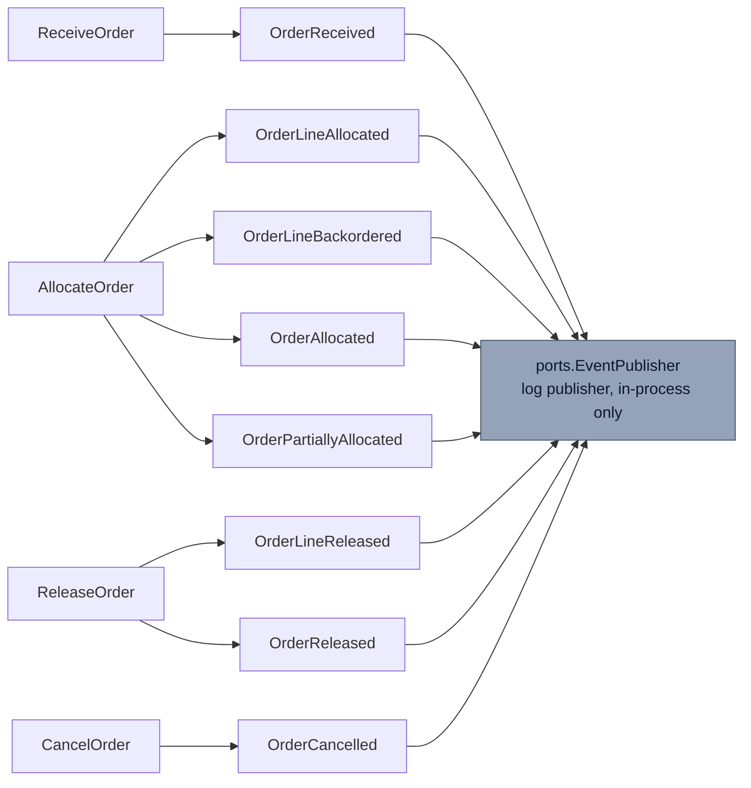

# Domain Events

Eight past-tense events, raised by the `Order` aggregate, per `CLAUDE.md`'s
"Domain events" section. Every event is published through a **local log
publisher only** in v1 — there is no Kafka integration, though
`ports.EventPublisher` is deliberately shaped so a Kafka producer could
satisfy it later without touching a use case.

```go
// internal/domain/shared/events.go
type DomainEvent interface {
	EventName() string
	OccurredAt() time.Time
}
```

## The catalog

| Event | Raised when |
| --- | --- |
| `OrderReceived` | `ReceiveOrder` accepts a new order into `Received` status |
| `OrderLineAllocated` | inventory-storage's `POST /reservations` succeeds for a line |
| `OrderLineBackordered` | inventory-storage returns `409` for a line (a business fact) |
| `OrderAllocated` | Every line on the order is now `Allocated` |
| `OrderPartiallyAllocated` | Some lines allocated, some backordered, on an order that allows partial shipment |
| `OrderLineReleased` | wes-work-planning's `POST /paths/{pathId}/work-units` succeeds for a line |
| `OrderReleased` | Every line on the order has been released as work |
| `OrderCancelled` | `CancelOrder` succeeds, revoking every allocated line's reservation |

## Why no Kafka in v1

Per `CLAUDE.md`'s explicitly deferred v1 scope, this context publishes
events through `outbound/events`, a log publisher, only. Domain events are
real and unit-tested (every use case has a
`Test*_EventPublishFails_PropagatesError` case), but nothing today
subscribes to them over a broker. `ports.EventPublisher` is the
Kafka-ready interface a real producer would implement later — adding one
is additive, not a redesign.

## Which use case emits what



## An operational-visibility event beyond the named eight

[ADR 0003](/docs/adr/0003-ship-complete-default-and-fail-closed-allocation)
documents one further event, `OrderAllocationPartiallyFailed`: raised when
`AllocateOrder` hits a hard, non-business (non-409) failure partway
through a pass over an order's lines. The lines that genuinely succeeded
before the failure are kept `Allocated` — discarding them would strand
real reservations inside inventory-storage — and the event exists purely
so that partial-progress outcome is operationally visible rather than only
discoverable by reading a source comment. It is not yet part of
`CLAUDE.md`'s summary catalog above; if this page and `CLAUDE.md` disagree
on the event list at a later reading, `CLAUDE.md` is the source of truth.

## Naming and payload shape

Every event embeds an `occurredAt` from the injected `Clock` port — never
wall-clock time read directly — so ordering is a domain fact, not an
infrastructure artefact. Payloads carry the minimum needed to make the
event self-describing: `OrderLineAllocated`, for example, carries
`OrderID`, `LineNo`, `SKU`, `Quantity`, and the Supplier's
`ReservationID` reference, but never a full `Order` snapshot.
