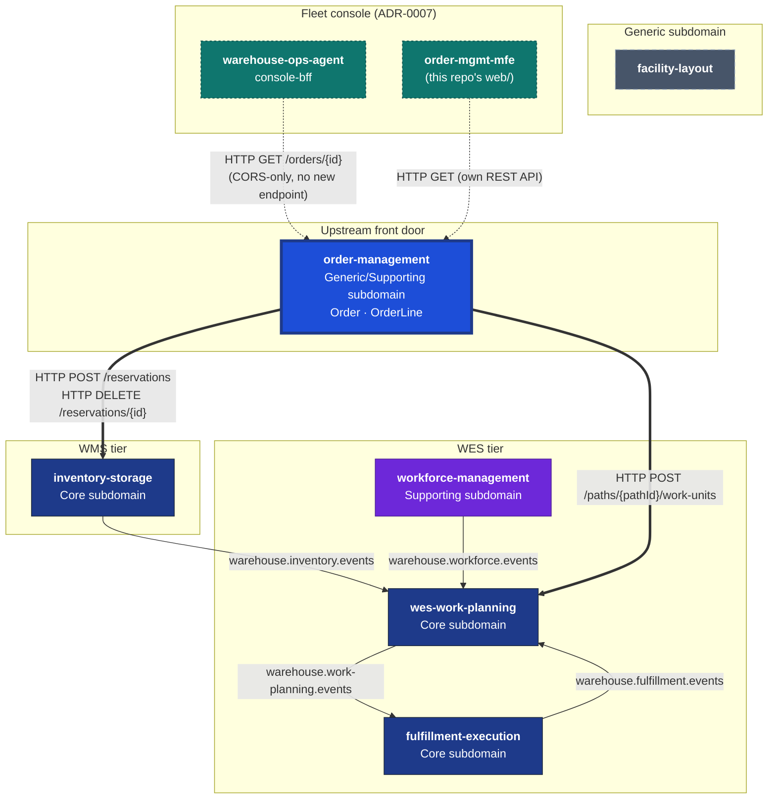

# Context Map

Order Management is the sixth service in the `warehouse-systems` platform,
and the only one so far whose only integrations are **synchronous HTTP
calls it makes outward** — it has no Kafka publisher, no Kafka consumer,
and no inbound integration from any sibling service.

## The platform, with this context's edges highlighted

**Bold edges are this context's own live HTTP calls.** Thin edges are the
pre-existing Kafka topics between the other five services — this context
does not participate in any of them. **Dashed teal edges are new inbound
callers** added by adopting the fleet's micro-frontend console architecture
(see [ADR-0007](../adr/0007-adopt-fleet-micro-frontend-console.md)): the
`warehouse-ops-agent` console-bff calls this service's existing
`GET /orders/{id}` as the first hop of its cross-service Order Lifecycle
fan-out, and this repo's own `order-mgmt-mfe` remote calls this service's
REST API directly for its own operator screens. Both are inbound HTTP only —
neither changes this context's own outbound Customer/Supplier calls below.

## New inbound callers (ADR-0007)

Per [ADR-0007](../adr/0007-adopt-fleet-micro-frontend-console.md), this
context adopted the fleet-wide micro-frontend console architecture defined in
`warehouse-ops-agent`'s own ADR-0002. Two new inbound HTTP callers exist as a
result — both **read-only**, both hitting endpoints that already existed:

| Caller | Call | Notes |
| --- | --- | --- |
| `warehouse-ops-agent` console-bff | `GET /orders/{id}` | First hop of the cross-cutting Order Lifecycle screen's fan-out. No new endpoint — the BFF already has the order id and calls this service's existing aggregate-root lookup. |
| `order-mgmt-mfe` (this repo's `web/`) | This service's full REST API | This context's own Module Federation remote, serving its own operator screens (order intake, allocation/release status, backorder visibility). |

Enabling both required adding `go-chi/cors` middleware to this service's
existing HTTP adapter (`CORS_ALLOWED_ORIGINS`, additive, no gateway) — the
only backend change this adoption required.

## This service's edges

### → `inventory-storage` (live, synchronous HTTP)

**Customer/Supplier.** Order Management is the Customer; inventory-storage
is the Supplier / Open Host Service. Per `CLAUDE.md`'s "Outbound HTTP
contracts" section, the exact contract consumed is:

| Call | Request | Response | Used by |
| --- | --- | --- | --- |
| `POST /reservations` | `{"sku":"...","quantity":N,"demandRef":"..."}` (this order's `OrderId` as `demandRef`) | `201`: `{"id":"...","sku":"...","quantity":N,"demandRef":"...","status":"...","allocations":[...],"expiresAt":"..."}` | `AllocateOrder`, `RetryAllocation` |
| `DELETE /reservations/{id}` | — | `204` on success | `CancelOrder` |

A `409` from `POST /reservations` means insufficient usable stock and maps
to `Backordered` for that line; any other non-2xx status or a transport
error propagates as a hard failure — never silently treated as
backordered.

### → `wes-work-planning` (live, synchronous HTTP)

**Customer/Supplier**, the same directional relationship the fleet's DDD
reference docs already use for WMS → WES, now applied one layer upstream.

| Call | Request | Response | Used by |
| --- | --- | --- | --- |
| `POST /paths/{pathId}/work-units` | `{"workUnitId":"...","cpt":"RFC3339","reference":"...","sku":"...","giftWrap":bool}` | `201`: `{"id":"...","pathId":"...","cpt":"RFC3339","reference":"...","state":"...","giftWrap":bool}` | `ReleaseOrder` |

`sku` and `giftWrap` are both optional fields already present on that
endpoint today — **no changes to wes-work-planning were needed or made**
for this context to exist.

## What this context explicitly does NOT do

Per `CLAUDE.md`'s "Bounded-context boundary" section (NON-NEGOTIABLE):

- **Imports no Go code from either Supplier.** This is a separate Go
  module in a separate repository. Not a type, not a constant, not a test
  helper.
- **Has no write access to their internal aggregates** — `Reservation`,
  `WorkPool`, `WorkUnit`, etc. — only to their published HTTP contracts
  above.
- **Has no database access to either Supplier's schema.**
- **This build is 100% additive from their point of view.** Neither
  repository is modified at all for this context to exist.

The only piece of Supplier state this context retains is the
`ReservationId` reference, held solely so `CancelOrder` can call
`DELETE /reservations/{id}` later. See
[ADR 0002](/docs/adr/0002-http-consumer-of-inventory-and-wes-not-shared-code)
for the full reasoning behind this boundary.

## No Kafka in v1

Per `CLAUDE.md`'s deferred scope, this context has no Kafka integration —
domain events are published through a local log publisher only (see
[Domain Events](/docs/ddd/domain-events)). Both outbound calls above are
therefore request/response HTTP, not asynchronous messages: `AllocateOrder`
and `ReleaseOrder` block on the Supplier's response and surface a `503`
with an RFC 7807 body if it cannot be reached or answers ambiguously.

## Failure-mode discipline (`MODE=http|permissive`)

Both outbound adapters follow the same permissive-by-default,
env-selected pattern already used three times elsewhere in this fleet
(inventory-storage → facility-layout, wes-work-planning →
inventory-storage, fulfillment-execution → inventory-storage):
`MODE=http|permissive` per adapter, defaulting to `permissive` so unit
tests never hit the network.

**Unlike those other adapters**, which fail-open because the lookups they
guard are soft/optional, calling `AllocateOrder`/`ReleaseOrder` while
wired to a permissive (no-op) client is NOT a soft concern here —
allocating real stock or releasing real work must never silently "succeed"
against a no-op. In permissive mode, both use cases return a clear
`ErrDownstreamNotConfigured` rather than fabricating a fake success. Only
`http` mode is suitable for any real integration test or deployment.
