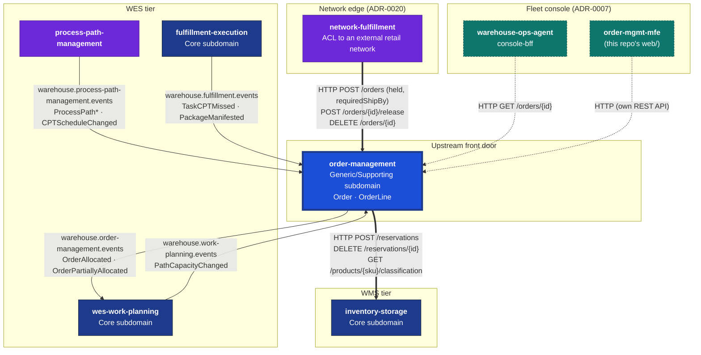

# Context Map

Order Management is the platform's upstream front door for demand. Its
integrations today are a mix of **synchronous HTTP it calls** (inventory-
storage), **Kafka it publishes** (release choreography, re-promise,
analytics), **Kafka it consumes** (capability, schedule, capacity and
fulfillment facts from three sibling contexts) and **inbound HTTP callers**
(the console, its own MFE, and `network-fulfillment`).

## The platform, with this context's edges highlighted

**Bold edges are synchronous HTTP; thin edges are Kafka topics; dashed teal
edges are the read-mostly console callers** (see
[ADR-0007](../adr/0007-adopt-fleet-micro-frontend-console.md)). Only the
Kafka edges this context itself publishes or consumes are drawn — the other
services' topics among themselves are out of scope for this page.

## Console callers (ADR-0007)

Per [ADR-0007](../adr/0007-adopt-fleet-micro-frontend-console.md), this
context adopted the fleet-wide micro-frontend console architecture defined in
`warehouse-ops-agent`'s own ADR-0002. Two inbound HTTP callers exist as a
result, both hitting endpoints that already existed:

| Caller | Call | Notes |
| --- | --- | --- |
| `warehouse-ops-agent` console-bff | `GET /orders/{id}` | First hop of the cross-cutting Order Lifecycle screen's fan-out. No new endpoint — the BFF already has the order id and calls this service's existing aggregate-root lookup. |
| `order-mgmt-mfe` (this repo's `web/`) | `POST /orders`, `GET /orders/{id}`, `DELETE /orders/{id}` | This context's own Module Federation remote: one screen with an order-intake form and a look-up/cancel panel. |

Enabling both required adding `go-chi/cors` middleware to this service's
existing HTTP adapter (`CORS_ALLOWED_ORIGINS`, additive, no gateway) — the
only backend change this adoption required.

## This service's edges

### → `inventory-storage` (live, synchronous HTTP)

**Customer/Supplier.** Order Management is the Customer; inventory-storage
is the Supplier / Open Host Service
(`internal/adapters/outbound/inventorystorage`, `INVENTORY_STORAGE_MODE` +
`INVENTORY_STORAGE_BASE_URL`):

| Call | Request | Response | Used by |
| --- | --- | --- | --- |
| `POST /reservations` | `{"sku":"...","quantity":N,"demandRef":"..."}` (this order's `OrderId` as `demandRef`) | `201`: `{"id":"...","sku":"...","quantity":N,"demandRef":"...","status":"...","allocations":[...],"expiresAt":"..."}` | `allocateAndRelease` (from `ReceiveOrder`, `RetryAllocation`) |
| `DELETE /reservations/{id}` | — | `204` on success | `CancelOrder` |

A `409` from `POST /reservations` means insufficient usable stock and maps
to `Backordered` for that line; any other non-2xx status or a transport
error propagates as a hard failure — never silently treated as
backordered.

A second, independent adapter
(`internal/adapters/outbound/productclassification`,
`PRODUCT_CLASSIFICATION_MODE`, same base URL) calls
`GET /products/{sku}/classification` to feed eligibility-driven path
selection ([ADR 0016](/docs/adr/0016-eligibility-driven-process-path-selection)).
Unlike the reservation client it fails **open**: a miss only drops a
routing hint and never rejects intake.

### → `wes-work-planning` (Kafka choreography, no HTTP)

Since [ADR 0005](/docs/adr/0005-choreographed-release-via-kafka) this
service no longer calls wes-work-planning at all. Release is announced as
`OrderAllocated`/`OrderPartiallyAllocated` on
`warehouse.order-management.events` (when `EVENT_PUBLISHER=kafka`), and
wes-work-planning's own consumer reconstructs the deterministic work-unit id
`{orderId}-line-{lineNo}` from the payload. See
[Domain Events](/docs/ddd/domain-events) for the frozen payload.

### ← `process-path-management`, `wes-work-planning`, `fulfillment-execution` (Kafka, inbound)

| Topic | Event types consumed | Adapter | Purpose |
| --- | --- | --- | --- |
| `warehouse.process-path-management.events` | `ProcessPathCreated` / `Updated` / `Deactivated` | `outbound/kafkacatalog` | Live catalogue + capability for path validation and promising ([ADR 0013](/docs/adr/0013-process-path-selection-as-a-domain-policy), [0014](/docs/adr/0014-promise-derived-from-fulfillment-capability)) |
| `warehouse.process-path-management.events` | `CPTScheduleChanged` | `outbound/kafkacptschedule` | Site CPT schedule for the promise ([ADR 0014](/docs/adr/0014-promise-derived-from-fulfillment-capability)) |
| `warehouse.work-planning.events` | `PathCapacityChanged` | `outbound/kafkapathcapacity` | Remaining path capacity per cutoff ([ADR 0015](/docs/adr/0015-wes-work-planning-path-capacity-changed-wired)) |
| `warehouse.fulfillment.events` | `TaskCPTMissed`, `PackageManifested` | `inbound/kafka` (`RepromiseConsumer`) | Re-promise loop, raises `OrderRepromised` ([ADR 0018](/docs/adr/0018-repromise-order-consumer-and-order-repromised)) |

The first three are local caches rebuilt by full replay under a
per-process-unique consumer group, enabled only by
`PATH_CATALOGUE_SOURCE=kafka` (default `none`, in which case the promise
always falls back to `LeadTimePolicy`). The re-promise consumer uses a
stable shared group (`order-management-repromise`) and runs whenever
`KAFKA_BROKERS` is set.

### ← `network-fulfillment` (inbound HTTP, ADR 0020)

`network-fulfillment` is the anti-corruption layer to an external retail
fulfillment network. Its `internal/adapters/outbound/ordermanagement`
client raises a **held** order (`releaseOnAllocation: false`,
`allowPartialShipment: false`, `requiredShipBy` = the network's deadline)
via `POST /orders`, reads an absent `promiseDate` as "cannot meet the
deadline", and later commits with `POST /orders/{id}/release` or rejects
with `DELETE /orders/{id}`. Network vocabulary (PO, ASIN, acknowledgement)
and customer PII stay on its side of the boundary — see
[ADR 0020](/docs/adr/0020-network-originated-demand-hold-and-deadline-feasibility).

## What this context explicitly does NOT do

- **Imports no Go code from any sibling context.** This is a separate Go
  module in a separate repository. Every inbound Kafka payload is decoded
  into this repo's own local struct.
- **Has no write access to other contexts' aggregates** — `Reservation`,
  `WorkPool`, `WorkUnit`, etc. — only to their published HTTP/Kafka
  contracts above.
- **Has no database access to any other context's schema.**

The only piece of Supplier state this context retains is the
`ReservationId` reference, held solely so `CancelOrder` can call
`DELETE /reservations/{id}` later. See
[ADR 0002](/docs/adr/0002-http-consumer-of-inventory-and-wes-not-shared-code)
for the full reasoning behind this boundary.

## Failure-mode discipline (`MODE=http|permissive`)

Both inventory-storage adapters follow the fleet's env-selected
`MODE=http|permissive` pattern, defaulting to `permissive` so unit tests
never hit the network. The classification lookup fails open like the rest
of the fleet's soft lookups. The reservation client does **not**:
allocating real stock must never silently "succeed" against a no-op, so in
permissive mode allocation returns `ErrDownstreamNotConfigured` (`503`
`downstream-not-configured`). Only `http` mode is suitable for any real
integration test or deployment.
