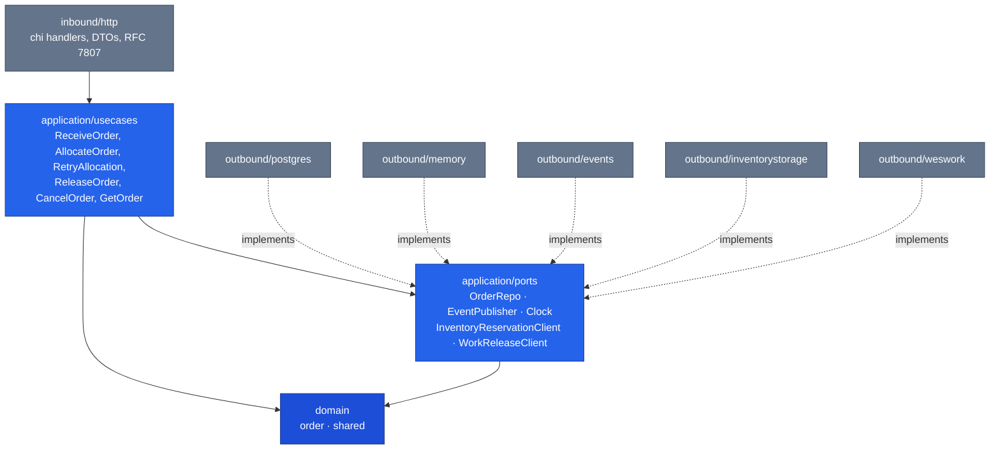

# Architecture

The service is **hexagonal (ports & adapters)** with one non-negotiable rule:

> **domain depends on nothing; application depends on domain; adapters
> depend on application/domain.**

No framework type, no `chi` router, no `pgx` connection, and no SQL string
ever appears inside `internal/domain/`.

## Layout

```text
cmd/order/                    main.go — composition root
internal/
  domain/
    order/                    Order aggregate, OrderLine, Status, invariants
    shared/                   value objects: OrderId, SKU, PathId, events, errors
  application/
    ports/                    OUT: OrderRepo, EventPublisher, Clock,
                               InventoryReservationClient, WorkReleaseClient
    usecases/                 ReceiveOrder, AllocateOrder, RetryAllocation,
                               ReleaseOrder, CancelOrder, GetOrder
  adapters/
    inbound/http/             chi handlers, DTOs, RFC7807 error mapping
    outbound/inventorystorage/  HTTP client: POST /reservations,
                                 DELETE /reservations/{id}
    outbound/weswork/           HTTP client: POST /paths/{pathId}/work-units
    outbound/postgres/        pgxpool repo + migrations
    outbound/memory/          in-memory repo for tests
    outbound/events/          log publisher (Kafka-ready interface, unused in v1)
migrations/                   golang-migrate SQL files
apis/openapi.yaml
docs/docs/adr/                Architecture Decision Records
```

## The dependency flow



Solid arrows are compile-time imports; dashed arrows are interface
satisfaction. No arrow points from the application layer into an adapter —
the application only ever names an interface in `application/ports`, and
`cmd/order/main.go` is the only place that decides which implementation
gets plugged in. See [ADR 0001](/docs/adr/0001-hexagonal-ports-and-adapters).

## Ports

| Port | Responsibility | Implementations |
| --- | --- | --- |
| `OrderRepo` | Persist/retrieve `Order`; mint IDs | `postgres`, `memory` |
| `EventPublisher` | Publish a `shared.DomainEvent` | `events` (log publisher) |
| `Clock` | `Now()` — makes promise-date computation deterministic in tests | `memory.SystemClock`, fixed clocks in tests |
| `InventoryReservationClient` | `Reserve`/`Revoke` against inventory-storage | `outbound/inventorystorage` (http), permissive no-op |
| `WorkReleaseClient` | Enqueue a work unit against wes-work-planning | `outbound/weswork` (http), permissive no-op |

Both outbound-Supplier ports are env-selected `MODE=http|permissive`
(defaulting to `permissive`, so unit tests never hit the network) — but
unlike the fail-open permissive adapters used for soft lookups elsewhere in
this fleet, `AllocateOrder`/`ReleaseOrder` against a permissive client
return a clear `ErrDownstreamNotConfigured` rather than a fabricated
success. Only `http` mode is suitable for a real integration test or
deployment.

## Composition root

`cmd/order/main.go` is the only file that reads environment variables and
the only file that knows both a port and its implementation:

| Env var | Default | Effect |
| --- | --- | --- |
| `HTTP_ADDR` | `:8080` | Listen address |
| `DATABASE_URL` | *(unset)* | If unset, the in-memory adapters are used and no database is required. |
| `MIGRATIONS_PATH` | `migrations` | Where golang-migrate looks for SQL files |
| `INVENTORY_STORAGE_MODE` | `permissive` | `http` or `permissive` |
| `INVENTORY_STORAGE_BASE_URL` | *(unset)* | Required when mode is `http` |
| `WES_WORK_PLANNING_MODE` | `permissive` | `http` or `permissive` |
| `WES_WORK_PLANNING_BASE_URL` | *(unset)* | Required when mode is `http` |
| `PROMISE_DEFAULT_LEAD_TIME` | `48h` | Promise-date lead time for any unlisted path |
| `PROMISE_PATH_LEAD_TIMES` | *(unset)* | Per-path overrides, e.g. `pick=24h,singles=6h` |

The in-memory fallback is deliberate: `go run ./cmd/order` with no
environment at all starts a fully functional service, which is what makes
the `httptest` suite cheap to run.

## Quality gates

Everything below runs in `.github/workflows/ci.yml` on every push and pull
request, per `CLAUDE.md`'s v1 scope:

| Job | What it enforces |
| --- | --- |
| `lint` | `golangci-lint` against the committed `.golangci.yml` (pinned `v2.13.1`) |
| `test` | Unit tests with `-race`; coverage gate of 90% on `internal/domain/...,internal/application/...` |

`mutation`, `bdd`, `helm-lint`, `docker-publish`, `release`, and
`integration` jobs are explicitly deferred — see the README's "Deferred
(v1)" section. This documentation site is built and deployed by a separate
workflow, `.github/workflows/docs.yml`, which never touches `ci.yml`.
