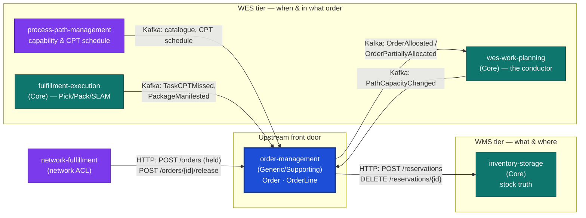

# Order Management

:::warning[Study project]
This repository is an educational exercise in Domain-Driven Design applied
to warehouse management/execution systems. It follows real industry-standard
patterns and terminology (WMS/WES/WCS, chaotic storage, CloudEvents, RFC
7807, hexagonal architecture) but is **not a production system** and is
**not affiliated with, endorsed by, or representative of any real-world
other company**.
:::

**Order Management** is the missing upstream Open Host Service for the
`warehouse-systems` fleet. It owns **Order** and **OrderLine** as
first-class, validated aggregates: intake, per-line stock allocation (via
inventory-storage), a capability-derived delivery promise, release of
allocated work (announced to wes-work-planning over Kafka), and
cancellation up to the release boundary.

It was the **sixth** Go service in the `warehouse-systems` platform, after
`inventory-storage`, `wes-work-planning`, `fulfillment-execution`,
`workforce-management` and `facility-layout`. Before it existed, "an order" was just an unowned, unvalidated string
(`OrderRef`/`DemandRef`/`Reference`) independently reinvented by three
different services.

## The one sentence that explains the design

> An order's `Status` is always **derived** from its line statuses, never
> stored redundantly — and this context has no write access to anything it
> did not itself create: allocation is an HTTP conversation and release is
> a published event, never a shared aggregate.

Ship-complete-by-default (BR3), fail-closed allocation (BR2), and the
cancellation boundary at release (BR6) are all consequences of taking that
sentence seriously.

## What it owns

| Capability | What that means here |
| --- | --- |
| **Order intake** | `ReceiveOrder(lines[], allowPartialShipment)` validates every line (non-empty SKU, positive quantity) and mints a real `OrderId` — the identity the rest of the platform was missing. |
| **Allocation** | Folded into `ReceiveOrder`/`RetryAllocation` (shared `allocateAndRelease`): inventory-storage's `POST /reservations` per line. A `409` is the business fact "no usable stock" (that line becomes `Backordered`); anything else fails the pass (fail-closed on ambiguity). |
| **Promise** | Computed at allocation time by `PromisePolicy`: a CPT window derived from process-path capability, the site CPT schedule and wes-work-planning capacity ([ADR 0014](/docs/adr/0014-promise-derived-from-fulfillment-capability)), per shipment group when partial shipment is allowed (ADR 0017), re-promised when fulfillment-execution reports a missed CPT (ADR 0018). `LeadTimePolicy` is the tagged fallback when those caches are unavailable. |
| **Release** | Marking allocated lines `Released` and announcing them as `OrderAllocated`/`OrderPartiallyAllocated` on Kafka, which wes-work-planning consumes ([ADR 0005](/docs/adr/0005-choreographed-release-via-kafka)). |
| **Hold and deadline feasibility** | An order received with `releaseOnAllocation: false` allocates and waits for `POST /orders/{id}/release`; an order with `requiredShipBy` is promised only a window that meets that deadline, or none at all ([ADR 0020](/docs/adr/0020-network-originated-demand-hold-and-deadline-feasibility)). |
| **Cancellation up to release** | `CancelOrder` revokes every allocated line's reservation via `DELETE /reservations/{id}`, but only while no line has reached `Released` (BR6). |
| **Order-level status derivation** | `Status` (`Received` → `Allocated`/`PartiallyAllocated`/`Backordered` → `Released`/`PartiallyReleased`/`Cancelled`) is computed from line statuses on every read, never stored. |

## What it deliberately does not own

Naming the boundary is as important as naming the capability. This service:

- **does not model a local Reservation aggregate** — it stores only the
  `ReservationId` reference returned by inventory-storage, which remains the
  sole source of truth for reservation state (usable-vs-reserved arithmetic
  lives there, not here);
- **does not model a local WorkUnit or release mechanics** — enqueuing and
  running work is wes-work-planning's job; this context only publishes the
  release event and never learns whether it was consumed;
- **does not pick, pack, ship, or route associates** — that is
  `fulfillment-execution`;
- **does not plan labour or headcount** — that is `workforce-management`;
- **does not model the physical building** (site, area, zone, aisle, bay,
  level, position) — that is `facility-layout`;
- **does not claw back released work on cancellation** — once any line is
  `Released`, v1 does not attempt to recall it; this is a documented,
  deliberate known gap (see [ADR 0004](/docs/adr/0004-cancellation-boundary-at-release)),
  not an oversight;
- **does not speak an external retail network's vocabulary** (PO, ASIN,
  acknowledgement) or hold customer PII — that is `network-fulfillment`,
  which calls this service over HTTP;
- **does not import Go code from any sibling context, and has no database
  access to any of them** — it consumes only their published HTTP and
  Kafka contracts (see
  [ADR 0002](/docs/adr/0002-http-consumer-of-inventory-and-wes-not-shared-code)).

## Where it sits relative to its neighbours

Allocation is synchronous HTTP; release, capability and re-promise facts
are Kafka events (when `EVENT_PUBLISHER=kafka` / `PATH_CATALOGUE_SOURCE=kafka`
/ `KAFKA_BROKERS` are set — see [Domain Events](/docs/ddd/domain-events)).
See [the context map](/docs/ecosystem/context-map) for the full relationship
analysis, including exactly which fields cross each wire.

## Where to go next

- **[Architecture](./architecture.md)** — the hexagonal layering and the
  strict dependency rule.
- **[Quickstart](./quickstart.md)** — run the service and exercise every
  endpoint with `curl`.
- **[Domain vision](/docs/business-context/domain-vision)** — why this
  service exists in this shape, and the gap it closes.
- **[API Reference](/docs/api-reference)** — generated from the real,
  Spectral-linted `apis/openapi.yaml`.
- **[ADRs](/docs/adr)** — the consequential decisions, in Nygard format.
