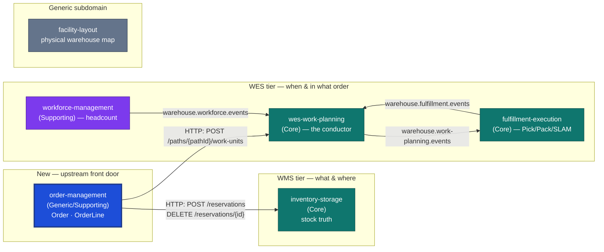

# Order Management

:::warning[Study project]
This repository is an educational exercise in Domain-Driven Design applied
to warehouse management/execution systems. It follows real industry-standard
patterns and terminology (WMS/WES/WCS, chaotic storage, CloudEvents, RFC
7807, hexagonal architecture) but is **not a production system** and is
**not affiliated with, endorsed by, or representative of Amazon or any
other company**.
:::

**Order Management** is the missing upstream Open Host Service for the
`warehouse-systems` fleet. It owns **Order** and **OrderLine** as
first-class, validated aggregates: intake, per-line stock allocation (via
inventory-storage), promise-date calculation, release of allocated work (via
wes-work-planning), and cancellation up to the release boundary.

It is the **sixth** Go service in the `warehouse-systems` platform —
`inventory-storage`, `wes-work-planning`, `fulfillment-execution`,
`workforce-management`, `facility-layout`, and now this one. Before it
existed, "an order" was just an unowned, unvalidated string
(`OrderRef`/`DemandRef`/`Reference`) independently reinvented by three
different services.

## The one sentence that explains the design

> An order's `Status` is always **derived** from its line statuses, never
> stored redundantly — and this context has no write access to anything it
> did not itself create: allocation and release are HTTP conversations, not
> shared aggregates.

Ship-complete-by-default (BR3), fail-closed allocation (BR2), and the
cancellation boundary at release (BR6) are all consequences of taking that
sentence seriously.

## What it owns

| Capability | What that means here |
| --- | --- |
| **Order intake** | `ReceiveOrder(lines[], allowPartialShipment)` validates every line (non-empty SKU, positive quantity) and mints a real `OrderId` — the identity the rest of the platform was missing. |
| **Allocation** | `AllocateOrder` calls inventory-storage's `POST /reservations` per line. A `409` is the business fact "no usable stock" (that line becomes `Backordered`); anything else fails the whole call (fail-closed on ambiguity). |
| **Promise dates** | Computed at allocation time by a domain policy function (`LeadTimePolicy`) using a configurable per-path lead time — real, tested domain logic, not a hardcoded field. |
| **Release** | `ReleaseOrder` calls wes-work-planning's `POST /paths/{pathId}/work-units` per allocated line, sending the promise date as `cpt` and the order id as `reference`. |
| **Cancellation up to release** | `CancelOrder` revokes every allocated line's reservation via `DELETE /reservations/{id}`, but only while no line has reached `Released` (BR6). |
| **Order-level status derivation** | `Status` (`Received` → `Allocated`/`PartiallyAllocated`/`Backordered` → `Released`/`PartiallyReleased`/`Cancelled`) is computed from line statuses on every read, never stored. |

## What it deliberately does not own

Naming the boundary is as important as naming the capability. This service:

- **does not model a local Reservation aggregate** — it stores only the
  `ReservationId` reference returned by inventory-storage, which remains the
  sole source of truth for reservation state (usable-vs-reserved arithmetic
  lives there, not here);
- **does not model a local WorkUnit or release mechanics** — enqueuing and
  running work is wes-work-planning's job; this context only calls
  `POST /paths/{pathId}/work-units` and records that the call succeeded;
- **does not pick, pack, ship, or route associates** — that is
  `fulfillment-execution`;
- **does not plan labour or headcount** — that is `workforce-management`;
- **does not model the physical building** (site, area, zone, aisle, bay,
  level, position) — that is `facility-layout`;
- **does not claw back released work on cancellation** — once any line is
  `Released`, v1 does not attempt to recall it; this is a documented,
  deliberate known gap (see [ADR 0004](/docs/adr/0004-cancellation-boundary-at-release)),
  not an oversight;
- **does not import Go code from inventory-storage or wes-work-planning, and
  has no database access to either** — it is a pure HTTP Customer of their
  already-published, already-stable REST contracts (see
  [ADR 0002](/docs/adr/0002-http-consumer-of-inventory-and-wes-not-shared-code)).

## Where it sits relative to the other five services

Both outbound edges are synchronous HTTP calls, not Kafka topics — this
service has no Kafka integration in v1 (a local log publisher only; see
[Domain Events](/docs/ddd/domain-events)). See
[the context map](/docs/ecosystem/context-map) for the full relationship
analysis, including exactly which fields cross each wire.

## Where to go next

- **[Architecture](./architecture.md)** — the hexagonal layering and the
  strict dependency rule.
- **[Quickstart](./quickstart.md)** — run the service and exercise every
  endpoint with `curl`.
- **[Domain vision](/docs/business-context/domain-vision)** — why this
  service exists in this shape, and the gap it closes.
- **[API Reference](/docs/api-reference)** — generated from the real,
  Spectral-linted `apis/openapi.yaml`.
- **[ADRs](/docs/adr)** — the consequential decisions, in Nygard format.
